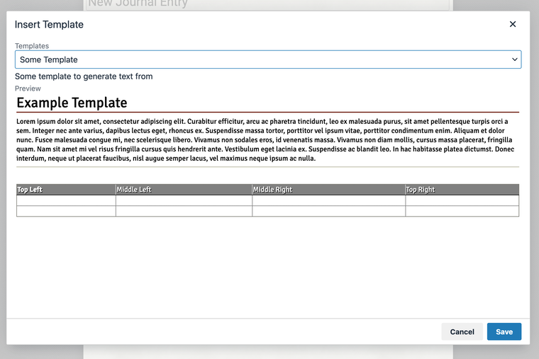

# Journal Templates for Foundry VTT

Create your own library of Journal Entry templates for any game system in Foundry VTT.

This module can be added to any game system or world. When the world starts, it will load templates from the `templates` folder within the module and make them available to the TinyMCE Editor used to write journal entries.

The `templates` icon is added to the editor toolbar.


Click on the stamp icon and select a template.



A template is a text file with some YAML FrontMatter followed by the HTML template itself:

```
---
title: Some Template
description: Some template to generate text from
---
<h1>Example Template</h1>
<p>Lorem ipsum dolor sit amet, consectetur adipiscing elit. Curabitur efficitur, arcu ac pharetra tincidunt, leo ex malesuada purus, sit amet pellentesque turpis orci a sem. Integer nec ante varius, dapibus lectus eget, rhoncus ex. Suspendisse massa tortor, porttitor vel ipsum vitae, porttitor condimentum enim. Aliquam et dolor nunc. Fusce malesuada congue mi, nec scelerisque libero. Vivamus non sodales eros, id venenatis massa. Vivamus non diam mollis, cursus massa placerat, fringilla quam. Nam sit amet mi vel risus fringilla cursus quis hendrerit ante. Vestibulum eget lacinia ex. Suspendisse ac blandit leo. In hac habitasse platea dictumst. Donec interdum, neque ut placerat faucibus, nisl augue semper lacus, vel maximus neque ipsum ac nulla.</p>
<hr />
<p>&nbsp;</p>
<table style="background-color: white;" border="1">
<thead>
<tr style="background-color: grey; color:white;">
<td><strong>Top Left</strong></td>
<td>Middle Left</td>
<td>Middle Right</td>
<td>Top Right</td>
</tr>
</thead>
<tbody>
<tr>
<td>&nbsp;</td>
<td>&nbsp;</td>
<td>&nbsp;</td>
<td>&nbsp;</td>
</tr>
<tr>
<td>&nbsp;</td>
<td>&nbsp;</td>
<td>&nbsp;</td>
<td>&nbsp;</td>
</tr>
</tbody>
</table>
```

The front matter **must** contain a `title` and `description` fields. It can optionally contain any other field.

When the template is loaded it is rendered using Handlebars, and any fields from the front matter can be included in the body of the template using ``{{field_name}}``.

For example: if a template contains ``{{title}}`` then the title field from the front matter is inserted.